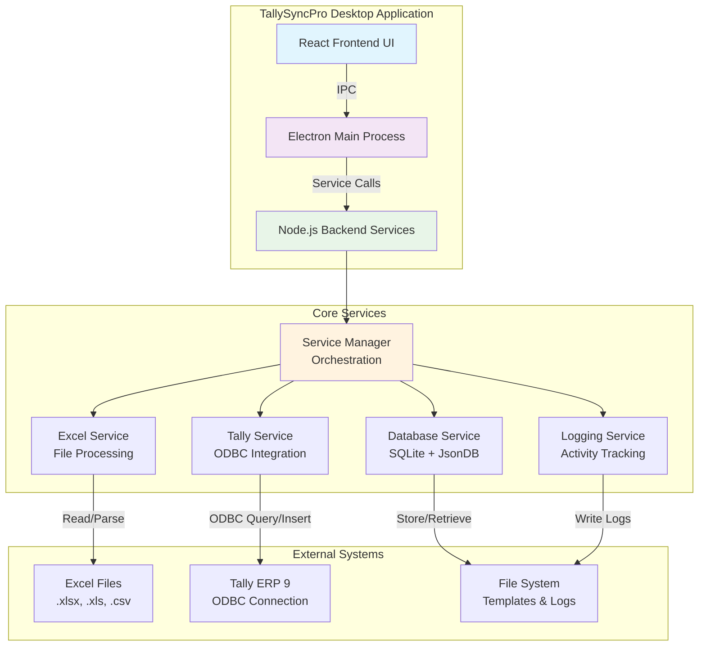
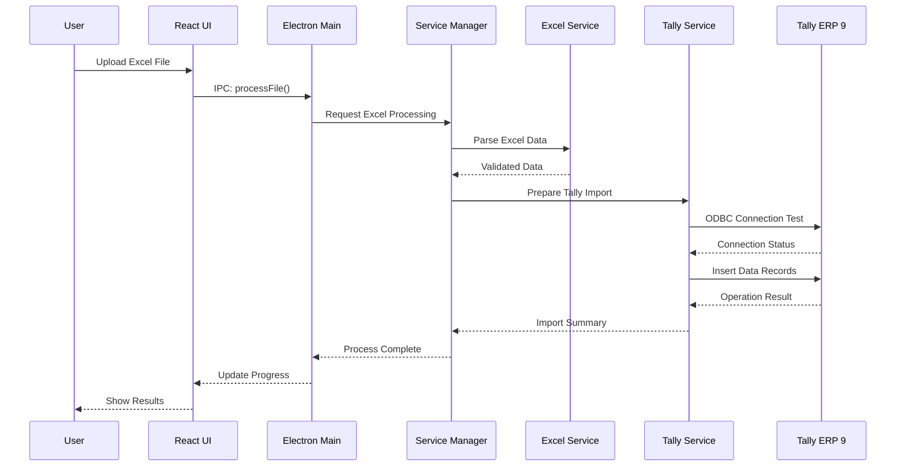
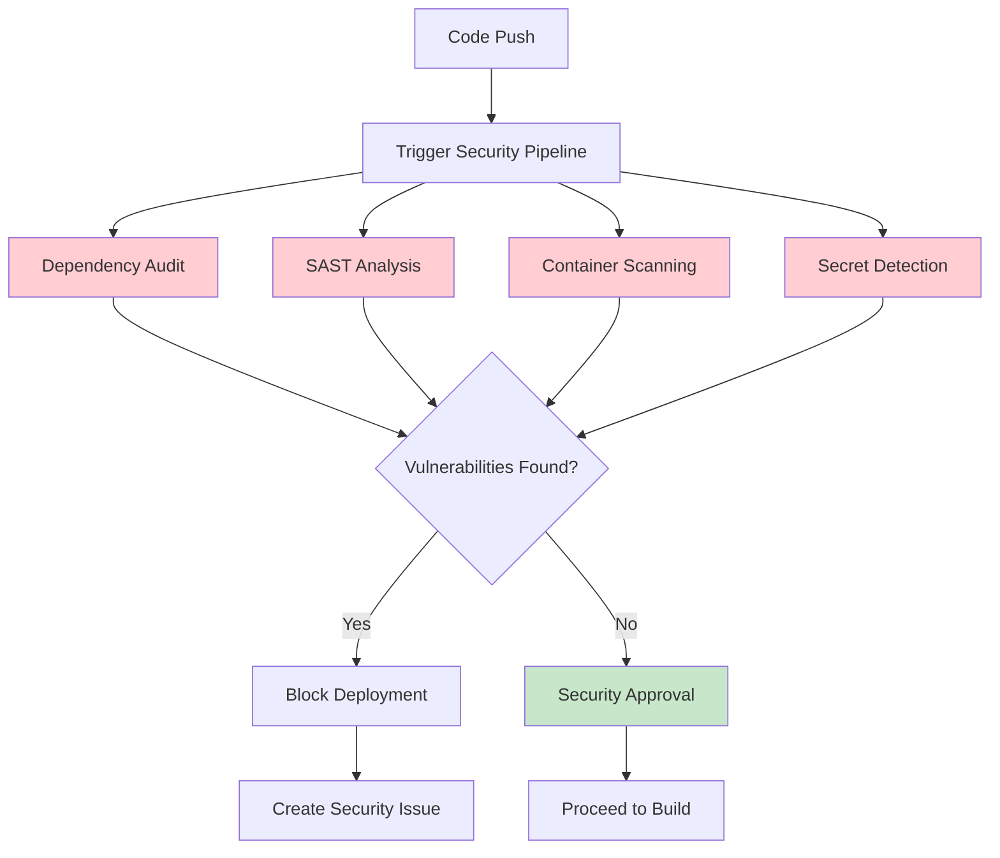
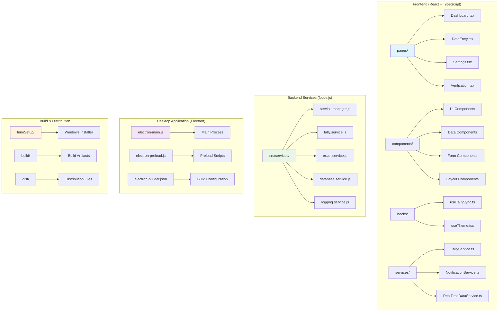
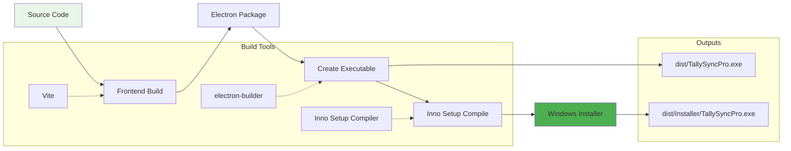

# 🚀 TallySyncPro

<div align="center">


**Enterprise-Grade Excel to Tally ERP 9 Integration Platform**

<div align="center">

[](https://github.com/digidenone/tallysyncpro/releases)


</div>

[](https://www.electronjs.org/)
[](https://reactjs.org/)
[](https://www.typescriptlang.org/)
[-blue?style=flat-square&logo=windows)](https://github.com/digidenone/tallysyncpro)
[](https://github.com/digidenone/tallysyncpro)

[📥 Download Installer](https://github.com/digidenone/tallysyncpro/releases/latest) • [📖 Documentation](docs/README.md) • [🚀 Quick Start](#-quick-start)

**Transform your Excel workflows into seamless Tally ERP 9 data synchronization**

*Professional desktop application built for accounting teams, data entry specialists, and business process automation*

</div>

---

## 📋 **Project Overview**

TallySyncPro is an enterprise-grade desktop application that bridges the gap between Excel-based data management and Tally ERP 9 systems. Built with Electron, React, and Node.js, it provides a robust, professional solution for accounting teams and business process automation.

### 🎯 **Core Objectives**
- **Eliminate Manual Data Entry**: Automate Excel-to-Tally data transfer with 99.9% accuracy
- **Enterprise Security**: Secure local processing with audit trail and error recovery
- **Professional Interface**: Business-focused desktop UI optimized for accounting workflows
- **ODBC Integration**: Direct database connectivity for reliable, fast data synchronization

### 🏢 **Target Users**
- **Accounting Teams**: Streamline monthly/quarterly data imports
- **Data Entry Specialists**: Reduce repetitive tasks and human errors
- **Business Analysts**: Bulk data processing and validation
- **Small-Medium Enterprises**: Cost-effective ERP data management
- **Real-time Feedback**: Intelligent toast notifications with spam prevention
- **Smooth Animations**: Framer Motion-powered transitions and interactions

### 🛡️ **Enterprise-Ready**
- **Data Validation**: Comprehensive validation before import
- **Error Handling**: Detailed error reporting and recovery guidance
- **Audit Trail**: Complete logging of all operations
- **Security**: Secure data handling and transmission

## 📚 **Application Features**

### **🏠 Dashboard**
- **Real-time KPIs**: Live performance metrics and sync statistics
- **Connection Status**: Visual monitoring of Tally ERP 9 connectivity
- **Quick Actions**: One-click access to common operations
- **Recent Activity**: History of imports and data processing

### **📝 Data Entry & Import**
- **Excel File Processing**: Support for .xlsx, .xls, and .csv formats
- **Template Management**: Pre-built templates for Tally data structures
- **Data Validation**: Real-time validation before import
- **Progress Tracking**: Live progress bars and status updates

### **⚙️ Configuration**
- **Tally Settings**: ODBC connection parameters and testing
- **Import Preferences**: Customizable validation rules and mappings
- **System Settings**: Application preferences and behavior
- **Backup Management**: Automated backup and recovery options

### **📊 Analytics & Reporting**
- **Import Statistics**: Detailed metrics on data processing
- **Error Analysis**: Comprehensive error reporting and resolution
- **Performance Monitoring**: System health and performance tracking
- **Audit Logs**: Complete activity trail for compliance


## 💼 **Enterprise Features**

### 🔗 **Advanced Integration**
- **Multi-Format Support**: Excel (.xlsx, .xls), CSV, and custom templates
- **Tally ERP 9 Compatibility**: Full ODBC integration with all Tally versions
- **Real-time Synchronization**: Live progress tracking with detailed analytics
- **Batch Processing**: Handle thousands of records efficiently with error handling

### 🛡️ **Security & Reliability**
- **Local Processing**: All data stays on your machine for maximum security
- **Audit Trail**: Complete logging of all operations with timestamping
- **Error Recovery**: Intelligent rollback and retry mechanisms
- **Data Validation**: Pre-import validation prevents data corruption

### 🎨 **Professional Interface**
- **Desktop-Optimized**: Fixed-width professional layout for business use
- **Dark/Light Themes**: Automatic theme switching based on system preference
- **Real-time Feedback**: Smart notifications with spam prevention
- **Smooth Animations**: Framer Motion-powered transitions and interactions

### 📊 **Analytics & Monitoring**
- **Dashboard Metrics**: Real-time KPIs and performance indicators
- **Connection Health**: Continuous monitoring of Tally connectivity
- **Processing Statistics**: Detailed reports on import operations
- **System Diagnostics**: Built-in troubleshooting tools

## 🛡️ **Security & Performance Features**

### **Enhanced Security**
- **Windows Security Integration**: Automatic firewall exception handling
- **Code Signing**: Digitally signed executables to prevent security warnings
- **Secure Communication**: Encrypted data transmission between components
- **Permission Management**: Controlled access to system resources

### **Performance Optimizations**
- **Memory Management**: Efficient resource utilization and cleanup
- **Background Processing**: Non-blocking operations for better responsiveness
- **Caching Strategy**: Smart caching for frequently accessed data
- **System Tray Integration**: Minimized resource usage when not actively used


### **Security Policy**
- **🛡️ Vulnerability Disclosure**: [SECURITY.md](SECURITY.md)
- **🔍 Security Advisories**: GitHub Security tab for public advisories
- **📊 Dependency Bot**: Automatic dependency updates with security patches
- **🔐 Secret Scanning**: Automatic detection of API keys and credentials
- **📝 Security Audit**: Monthly security reviews and penetration testing

### **Windows Integration**
- **Auto-start Capability**: Optional startup with Windows
- **System Tray Functionality**: 
  - Background operation
  - Quick access to common functions
  - Status monitoring
  - Graceful shutdown options
- **Native Notifications**: Windows toast notifications for important events

---

## 📖 **Documentation**

### **User Guide**
- Comprehensive instructions for end-users
- Step-by-step tutorials for common tasks
- Troubleshooting tips and FAQs

### **API Reference**
- Detailed documentation of all API endpoints
- Code examples and usage guidelines
- Authentication and authorization details

### **Developer Guide**
- Setup instructions for local development
- Architecture overview and design decisions
- Contribution guidelines and best practices

---

## 🎯 **System Architecture**



## 📊 **Data Flow Architecture**


### **🔒 Security Features**

#### **Automated Security Scanning**


---

## 🚀 **Quick Start**

> 📖 **For detailed setup instructions, see our comprehensive [Getting Started Guide](GETTING-STARTED.md)**


### **🎯 Option 1: End User Installation (Recommended)**

1. **Download & Install**
   ```   # Download from GitHub Releases
   TallySyncPro.exe (64-bit Windows installer)
   ```
   - Run installer as Administrator
   - Follow installation wizard
   - Launch from Desktop shortcut

2. **Configure Tally Connection**
   - Ensure Tally ERP 9 ODBC is enabled
   - Enter connection details in Settings
   - Test connection and start syncing

### **🔧 Option 2: Developer Setup**

```bash
# Prerequisites: Node.js 18+, Git, Tally ERP 9
git clone https://github.com/digidenone/tallysyncpro.git
cd tallysyncpro

# Install dependencies
npm install
cd frontend && npm install && cd ..

# Development mode
npm run dev

# Build installer
cd build
verify-build-setup.bat
build-installer.bat
npm install
cd frontend && npm install && cd ..

# Development commands
npm run dev         # Development mode with hot reload
npm start          # Production mode  
npm run build      # Build frontend only
npm run pack       # Package Electron app (creates .exe files)

# Build output: dist-electron/win-unpacked/TallySyncPro.exe
# Then use InnoSetup to create: TallySyncPro.exe
```

### **🏗️ Option 3: One-Click Installer Build**

For creating a complete Windows installer package:

```batch
# Option A: Verify setup first (Recommended)
verify-build-setup.bat  # Check prerequisites
build-installer.bat     # Build installer

# Option B: Direct build
build-installer.bat     # Build directly
```

**📋 What it does:**
- ✅ Checks all prerequisites (Node.js, npm, Inno Setup)
- ✅ Cleans previous builds and installs dependencies
- ✅ Builds frontend and packages Electron application
- ✅ Creates professional Windows installer
- ✅ Generates build logs and verification checksums

**🔧 Prerequisites Verification:**
- **Script**: [`verify-build-setup.bat`](verify-build-setup.bat)
- **Purpose**: Validates Node.js, npm, Inno Setup installation
- **Usage**: Run before building to ensure all tools are available

**📦 Output:** `dist/installer/TallySyncPro.exe`

> 💡 **Tip**: The build script includes comprehensive error handling and logging. Check `logs/build_YYYYMMDD_HHMMSS.log` for detailed build information.

> 🔧 **Verify Setup**: Run `verify-build-setup.bat` to check all prerequisites before building.

---

## 🏗️ **Project Architecture**



### **📁 Detailed File Structure**
```
tallysyncpro/
├── 📄 electron-main.js              # Electron main process entry point
├── 📄 electron-preload.js           # Secure context bridge
├── 📄 electron-builder.json         # Electron packaging configuration
├── 📄 package.json                  # Root dependencies and scripts
├── 📄 start-tallysyncpro.bat       # Quick start script for Windows
│
├── 📁 frontend/                      # React frontend application
│   ├── 📄 package.json             # Frontend dependencies
│   ├── 📄 vite.config.ts           # Vite build configuration
│   ├── 📄 tailwind.config.ts       # Tailwind CSS styling
│   ├── 📄 index.html               # HTML entry point
│   ├── 📁 src/
│   │   ├── 📁 components/          # React components library
│   │   │   ├── 📁 ui/              # Base UI components (shadcn/ui)
│   │   │   ├── 📁 data/            # Data handling & visualization
│   │   │   ├── 📁 forms/           # Form components & validation
│   │   │   ├── 📁 layout/          # Layout and navigation
│   │   │   └── 📁 common/          # Shared utilities
│   │   ├── 📁 pages/               # Application route components
│   │   │   ├── 📄 Dashboard.tsx    # Main dashboard view
│   │   │   ├── 📄 DataEntry.tsx    # Data import interface
│   │   │   ├── 📄 Settings.tsx     # Configuration panel
│   │   │   └── 📄 Verification.tsx # Data validation view
│   │   ├── 📁 hooks/               # Custom React hooks
│   │   │   ├── 📄 useTallySync.ts  # Main integration hook
│   │   │   ├── 📄 useTheme.tsx     # Theme management
│   │   │   └── 📄 useAPI.tsx       # API communication
│   │   ├── 📁 services/            # Frontend business logic
│   │   │   ├── 📄 TallyService.ts  # Tally ERP integration
│   │   │   ├── 📄 NotificationService.ts # User notifications
│   │   │   └── 📄 RealTimeDataService.ts # Live data updates
│   │   ├── 📁 types/               # TypeScript type definitions
│   │   ├── 📁 config/              # App configuration constants
│   │   └── 📁 lib/                 # Utility functions
│   └── 📁 public/                   # Static assets
│       ├── 📄 favicon.ico          # Application icon
│       └── 📁 downloads/            # Excel templates
│           ├── 📄 AccountingVouchers.xlsx
│           ├── 📄 AllAccountingMasters.xlsx
│           └── 📄 TallySync-Excel-Templates.zip
│
├── 📁 src/                          # Backend Node.js services
│   ├── 📁 services/                # Core business logic services
│   │   ├── 📄 service-manager.js   # Service orchestration & lifecycle
│   │   ├── 📄 tally.service.js     # Tally ERP ODBC integration
│   │   ├── 📄 excel.service.js     # Excel file processing
│   │   ├── 📄 database.service.js  # SQLite data management
│   │   ├── 📄 logging.service.js   # Structured logging system
│   │   └── 📄 frontend-api.service.js # Frontend-backend bridge
│   ├── 📁 config/                  # Backend configuration
│   │   ├── 📄 app.config.js        # Application settings
│   │   └── 📄 database.config.js   # Database configuration
│   └── 📁 components/              # Shared components
│       └── 📄 splash-screen.js     # Application splash screen
│
├── 📁 InnoSetup/                    # Windows installer package
│   ├── 📄 TallySyncPro.iss         # Inno Setup compilation script
│   ├── 📄 License.txt              # End User License Agreement
│   ├── 📄 PreInstall-Info.txt      # Pre-installation information
│   ├── 📄 PostInstall-Info.txt     # Post-installation guide
│   └── 📄 README.md                # Installer build documentation
│
├── 📁 docs/                         # Comprehensive documentation
│   ├── 📄 README.md                # Documentation index
│   ├── 📄 GETTING-STARTED.md       # Setup and onboarding guide
│   ├── 📄 INSTALLATION.md          # Installation instructions
│   ├── 📄 PROJECT-STRUCTURE.md     # Architecture documentation
│   ├── 📄 FRONTEND-DEVELOPMENT.md  # Frontend development guide
│   ├── 📄 ELECTRON-DEVELOPMENT.md  # Electron development guide
│   ├── 📄 TESTING.md               # Testing strategies
│   └── 📄 CONTRIBUTING.md          # Contribution guidelines
│
├── 📁 build/                        # Build configuration and scripts
│   ├── 📄 build-installer.bat      # Main installer build script
│   ├── 📄 verify-build-setup.bat   # Prerequisites verification
│   ├── 📄 start-tallysyncpro.bat   # Quick development start
│   ├── 📄 installer.nsh            # NSIS installer script (legacy)
│   └── 📄 LICENSE                  # License file for installer
│
├── 📁 assets/                       # Application assets
│   ├── 📄 icon.ico                 # Application icon
│   ├── 📄 splash.html              # Splash screen HTML
│   └── 📄 TallySyncPro.exe.manifest # Application manifest
│
└── 📁 dist-electron/               # Electron build outputs
    ├── � win-unpacked/            # Unpacked Electron application
    │   ├── �📄 TallySyncPro.exe     # Main executable (source for installer)
    │   ├── 📁 resources/           # Electron resources
    │   ├── 📁 locales/             # Localization files
    │   └── 📄 *.dll, *.pak, *.dat  # Electron dependencies
    │
    # After InnoSetup compilation:
    # 📄 TallySyncPro.exe             # Final installer (64-bit)
```

---

## 🔧 **Technology Stack**

```mermaid
graph TB
    subgraph "Frontend Technologies"
        FT1[React 18] --> FT2[TypeScript 5+]
        FT2 --> FT3[Vite Build Tool]
        FT3 --> FT4[Tailwind CSS]
        FT4 --> FT5[shadcn/ui Components]
        FT5 --> FT6[TanStack Query]
        FT6 --> FT7[React Router]
    end
    
    subgraph "Desktop Framework"
        DT1[Electron Latest] --> DT2[Node.js 18+]
        DT2 --> DT3[Express.js 4+]
        DT3 --> DT4[SQLite Database]
        DT4 --> DT5[JsonDB Config]
        DT5 --> DT6[Winston Logging]
    end
    
    subgraph "Integration Layer"
        IT1[ODBC Driver] --> IT2[Tally ERP 9]
        IT3[ExcelJS] --> IT4[File System]
        IT5[IPC Communication] --> IT6[Service Manager]
    end
    
    subgraph "Build & Deploy"
        BT1[electron-builder] --> BT2[Inno Setup 6+]
        BT2 --> BT3[Windows Installer]
        BT4[Vite Build] --> BT5[Static Assets]
        BT6[GitHub Actions] --> BT7[CI/CD Pipeline]
    end
    
    style FT1 fill:#61dafb
    style DT1 fill:#47848f
    style IT1 fill:#ff9800
    style BT1 fill:#4caf50
```



### **📋 Detailed Technology Specifications**

| **Category** | **Technology** | **Version** | **Purpose** | **License** |
|--------------|----------------|-------------|-------------|-------------|
| **🎨 Frontend** |
| Framework | React | 18.2+ | Component-based UI development | MIT |
| Language | TypeScript | 5.0+ | Type safety and developer experience | Apache-2.0 |
| Build Tool | Vite | 4.4+ | Fast development and optimized builds | MIT |
| Styling | Tailwind CSS | 3.3+ | Utility-first CSS framework | MIT |
| Components | shadcn/ui | Latest | Professional component library | MIT |
| State Management | TanStack Query | 4.29+ | Server state management | MIT |
| Routing | React Router | 6.14+ | Client-side navigation | MIT |
| Animations | Framer Motion | 10.12+ | Smooth UI transitions | MIT |
| **🖥️ Desktop** |
| Runtime | Electron | Latest | Cross-platform desktop apps | MIT |
| Backend | Node.js | 18.16+ | JavaScript runtime environment | MIT |
| Framework | Express.js | 4.18+ | Web application framework | MIT |
| Database | SQLite | 3.42+ | Embedded relational database | Public Domain |
| Configuration | JsonDB | 2.3+ | JSON-based configuration storage | MIT |
| Logging | Winston | 3.9+ | Structured logging library | MIT |
| **🔗 Integration** |
| Database Driver | ODBC | Native | Tally ERP database connectivity | System |
| File Processing | ExcelJS | 4.3+ | Excel file parsing and generation | MIT |
| Process Communication | Electron IPC | Native | Secure inter-process communication | MIT |
| System Tray | Electron Native | Native | Windows system tray integration | MIT |
| **🛠️ Build Tools** |
| Packager | electron-builder | 24.4+ | Electron application packaging | MIT |
| Installer | Inno Setup | 6.2+ | Windows installer creation | Free |
| Code Quality | ESLint | 8.44+ | JavaScript/TypeScript linting | MIT |
| Formatter | Prettier | 2.8+ | Code formatting | MIT |
| Testing | Vitest | 0.33+ | Unit testing framework | MIT |

---

## 📦 **Creating Windows Installer**

### **🛠️ Build Process Overview**



### **📋 Step-by-Step Build Guide**

#### **Step 1: Prepare Build Environment**
```bash
# Ensure clean environment
npm run clean

# Install all dependencies
npm install
cd frontend && npm install && cd ..

# Verify build prerequisites
node --version          # Should be 18.16+
npm --version           # Should be 9.0+
```

#### **Step 2: Build Frontend Application**
```bash
# Build React frontend with Vite
cd frontend
npm run build

# Verify build output
dir dist                    # Should contain: index.html, assets/, etc.
cd ..
```

#### **Step 3: Package Electron Application**
```bash
# Package the complete Electron application
npm run build

# This creates the following structure:
# dist/
# ├── TallySyncPro.exe           # Main executable
# ├── resources/
# │   ├── app.asar              # Application bundle
# │   └── electron.asar         # Electron framework
# ├── locales/                  # Internationalization
# ├── swiftshader/              # Graphics acceleration
# └── *.dll                     # Required libraries
```

#### **Step 4: Install Inno Setup Compiler**
```bash
# Download and install Inno Setup
# URL: https://jrsoftware.org/isdl.php
# Choose: Inno Setup 6.2.2 or later

# Verify installation
where ISCC.exe
# Expected output: C:\Program Files (x86)\Inno Setup 6\ISCC.exe
```

#### **Step 5: Compile the Installer**

**Option A: Using Inno Setup GUI**
```bash
# 1. Open Inno Setup Compiler
# 2. File → Open → Select "InnoSetup\TallySyncPro.iss"
# 3. Build → Compile (or press F9)
# 4. Wait for compilation to complete
```

**Option B: Command Line Compilation**
```bash
# Navigate to InnoSetup directory
cd InnoSetup

# Compile using command line
"C:\Program Files (x86)\Inno Setup 6\ISCC.exe" TallySyncPro.iss

# Output: dist\installer\TallySyncPro.exe
```

#### **Step 6: Automated Build Script**

**🚀 One-Click Build Solution**

We've created a professional automated build script for easy installer creation. Simply run:

```batch
# One-click build command
build-installer.bat
```

**📋 Build Script Features:**
- ✅ **Prerequisites Check**: Verifies Node.js, npm, and Inno Setup installation
- ✅ **Automated Cleanup**: Removes old build artifacts before starting
- ✅ **Dependency Management**: Installs/updates all required packages
- ✅ **Multi-stage Build**: Frontend → Electron → Installer creation
- ✅ **Error Handling**: Detailed error messages and troubleshooting guidance
- ✅ **Build Logging**: Comprehensive logs saved to `logs/build_YYYYMMDD_HHMMSS.log`
- ✅ **Verification**: Automatic validation of build outputs
- ✅ **Statistics**: File sizes and checksums for distribution

**🔧 Build Process Overview:**


**📁 Script Location**: [`build-installer.bat`](build-installer.bat) | [`verify-build-setup.bat`](verify-build-setup.bat)

**🔧 Prerequisites Verification:**
Before building, you can run the verification script to check your environment:
```batch
# Check build environment
verify-build-setup.bat
```

**🎯 What the Script Does:**

1. **🔍 Step 1**: Checks for Node.js 18+, npm, and Inno Setup 6
2. **🧹 Step 2**: Cleans previous builds and temporary files  
3. **📦 Step 3**: Installs root and frontend dependencies
4. **⚛️ Step 4**: Builds React frontend with Vite optimization
5. **�️ Step 5**: Packages Electron application with all assets
6. **📦 Step 6**: Compiles Windows installer using Inno Setup

**📊 Build Output:**
```
dist/
├── TallySyncPro.exe              # Main executable (150-200MB)
├── installer/
│   └── TallySyncPro.exe  # Windows installer (200-300MB)
└── resources/                    # Application resources

logs/
└── build_YYYYMMDD_HHMMSS.log    # Detailed build log
```

#### **🛠️ Build Tools Summary**

| Tool | File | Purpose | Usage |
|------|------|---------|-------|
| **🔍 Environment Checker** | [`verify-build-setup.bat`](verify-build-setup.bat) | Validates prerequisites | `verify-build-setup.bat` |
| **🚀 Complete Builder** | [`build-installer.bat`](build-installer.bat) | Full build process | `build-installer.bat` |
| **📦 npm Scripts** | `package.json` | Various build commands | `npm run build-installer` |

**🎯 Recommended Workflow:**
1. **First time**: `verify-build-setup.bat` → `build-installer.bat`
2. **Subsequent builds**: `build-installer.bat` (includes verification)
3. **npm users**: `npm run build-installer`

---

## 👥 **Meet the Digidenone Team**

<div align="center">

**The talented team behind TallySyncPro**

</div>

### **Core Team Members**

| Role | Name | Responsibilities | GitHub Profile |
|------|------|-----------------|----------------|
| **CEO & Backend Lead** | **Chirag Nahata** | Backend Development | [](https://github.com/chiragnahata) |
| **CTO & Frontend Lead** | **Snigdha Ghosh** | Frontend Development & UI/UX | [](https://github.com/snig-code16) |
| **Co-CEO & Legal Side Handling** | **Ariyan Bhattarcharjee** | Legal Matters & Strategic Planning | [](https://github.com/hub-ARIYAN) |
| **COO & Documentation** | **Shamonnoy Halder** | Documentation & CRM Management | [](https://github.com/Shamonnoy) |
| **Developer & QA** | **Somyadip Ghosh** | Testing & Research | [](https://github.com/somyadipghosh) |
| **Sales & Client Relations** | **Hitesh Roy** | Client Coordination & Sales | [](https://github.com/hitwesh) |

### **Team Expertise**

<div align="center">

| **Backend** | **Frontend Development** | **Integration & Testing** |
|:---------------------:|:------------------------:|:-------------------------:|
| Chirag Nahata | Snigdha Ghosh | Chirag Nahata + Snigdha Ghosh |
| Modern React & TypeScript | Seamless API Integration |
| Database Architecture | Responsive UI/UX Design | End-to-End Testing |

| **Documentation & CRM** | **Testing & Research** | **Legal & Sales** |
|:------------------------:|:----------------------:|:-----------------:|
| Shamonnoy Halder | Somyadip Ghosh | Ariyan Bhattarcharjee + Hitesh Roy |
| Technical Documentation | Quality Assurance | Legal Compliance |
| CRM Management | Research & Analysis | Client Relations |

</div>

### **Contact the Team**

- **🏢 Company**: [Digidenone](https://digidenone.is-a.dev)
- **📧 General Inquiries**: digidenone@gmail.com
- **📱 Support Hotline**: [+917439611385](tel:+917439611385)

---

## 🤝 **Contributing**

We welcome contributions to TallySyncPro! Please see our [Contributing Guide](docs/CONTRIBUTING.md) for details on:

- Code of Conduct
- Development Workflow
- Pull Request Process
- Issue Reporting
- Feature Requests

---

## 📞 **Support**

### **📖 Documentation**
- [Getting Started Guide](docs/GETTING-STARTED.md)
- [Installation Instructions](docs/INSTALLATION.md)
- [Project Structure](docs/PROJECT-STRUCTURE.md)
- [Frontend Development](docs/FRONTEND-DEVELOPMENT.md)
- [Electron Development](docs/ELECTRON-DEVELOPMENT.md)
- [Testing Guide](docs/TESTING.md)

### **🆘 Get Help**
- [GitHub Issues](https://github.com/digidenone/tallysyncpro/issues) - Bug reports and feature requests
- [GitHub Discussions](https://github.com/digidenone/tallysyncpro/discussions) - Community support
- [Email Support](mailto:digidenone@gmail.com) - Direct support for enterprise users

### **🌐 Community**
- [Official Website](https://digidenone.is-a.dev)

---

## 📄 **License**

This project is licensed under the MIT License - see the [LICENSE](LICENSE) file for details.

---

## 🙏 **Acknowledgments**

- **Electron** - Cross-platform desktop framework
- **React** - Frontend UI library
- **Tally Solutions** - ERP system integration
- **shadcn/ui** - Beautiful component library
- **Vite** - Lightning-fast build tool

---

<div align="center">

[⭐ Star us on GitHub](https://github.com/digidenone/tallysyncpro) | [🍴 Fork the project](https://github.com/digidenone/tallysyncpro/fork)

**Built with ❤️ for the accounting and business automation community**

</div>

---
