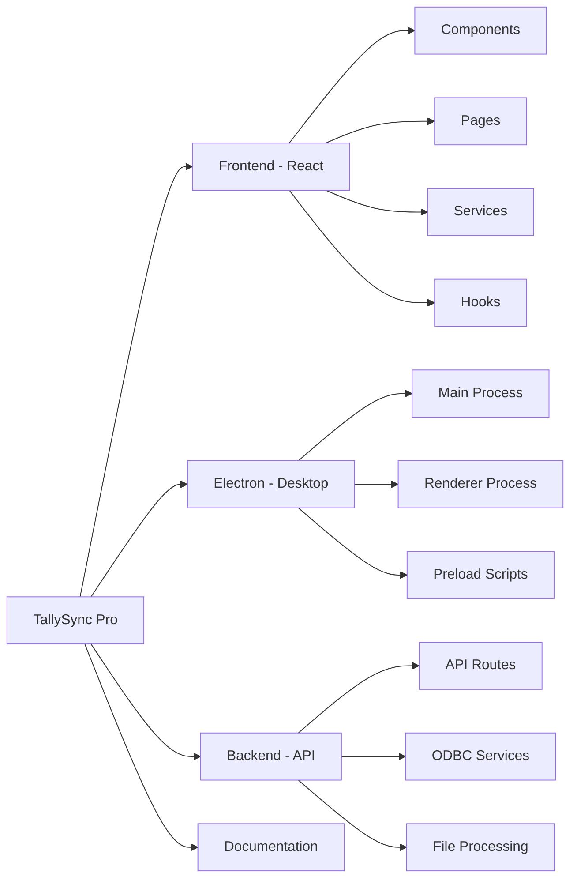

# 🤝 Contributing to TallySync Pro

Welcome to the TallySync Pro project! We're excited that you're interested in contributing. This guide will help you get started and ensure a smooth contribution process.

## 📋 Table of Contents

- [Code of Conduct](#code-of-conduct)
- [Getting Started](#getting-started)
- [Development Setup](#development-setup)
- [Contributing Workflow](#contributing-workflow)
- [Coding Standards](#coding-standards)
- [Testing Guidelines](#testing-guidelines)
- [Documentation](#documentation)
- [Pull Request Process](#pull-request-process)
- [Issue Guidelines](#issue-guidelines)
- [Community](#community)

## 📜 Code of Conduct

This project and everyone participating in it is governed by our Code of Conduct. By participating, you are expected to uphold this code.

### Our Pledge
- **Be Respectful**: Treat everyone with respect and kindness
- **Be Inclusive**: Welcome people of all backgrounds and experiences
- **Be Constructive**: Provide helpful feedback and suggestions
- **Be Professional**: Maintain a professional and collaborative atmosphere

## 🚀 Getting Started

### Prerequisites

Before you begin, ensure you have the following installed:

- **Node.js** (v18 or higher)
- **npm** or **yarn** package manager
- **Git** for version control
- **VS Code** (recommended IDE)
- **Tally ERP 9 or Prime** (for testing integration)

### Quick Setup

1. **Fork the repository**
   ```bash
   # Visit: https://github.com/digidenone/tallysync-pro
   # Click "Fork" button
   ```

2. **Clone your fork**
   ```bash
   git clone https://github.com/YOUR_USERNAME/tallysync-pro.git
   cd tallysync-pro
   ```

3. **Add upstream remote**
   ```bash
   git remote add upstream https://github.com/digidenone/tallysync-pro.git
   ```

4. **Install dependencies**
   ```bash
   npm install
   cd desktop-electron-odbc/frontend
   npm install
   cd ../..
   ```

5. **Start development server**
   ```bash
   npm run dev
   ```

## 🛠️ Development Setup

### Environment Configuration

Create a `.env` file in the root directory:

```env
# Development Configuration
NODE_ENV=development
VITE_DEV_SERVER=true
VITE_API_URL=http://localhost:3001

# Tally Configuration
VITE_TALLY_HOST=localhost
VITE_TALLY_PORT=9000

# Application Settings
VITE_APP_NAME=TallySync Pro
VITE_APP_VERSION=1.0.0
VITE_LOG_LEVEL=debug
```

### Recommended VS Code Extensions

Install these extensions for the best development experience:

```json
{
  "recommendations": [
    "esbenp.prettier-vscode",
    "bradlc.vscode-tailwindcss",
    "ms-vscode.vscode-typescript-next",
    "formulahendry.auto-rename-tag",
    "christian-kohler.path-intellisense",
    "ms-vscode.vscode-eslint",
    "ms-playwright.playwright"
  ]
}
```

### Project Structure



## 🔄 Contributing Workflow

### 1. Choose an Issue

- Browse [open issues](https://github.com/digidenone/tallysync-pro/issues)
- Look for issues labeled `good first issue` for beginners
- Comment on the issue to express your interest
- Wait for maintainer approval before starting work

### 2. Create a Feature Branch

```bash
# Sync with upstream
git checkout main
git pull upstream main

# Create feature branch
git checkout -b feature/your-feature-name
# or
git checkout -b fix/your-fix-name
```

### 3. Make Your Changes

- Follow our [coding standards](#coding-standards)
- Write tests for new functionality
- Update documentation as needed
- Commit changes with descriptive messages

### 4. Test Your Changes

```bash
# Run all tests
npm test

# Run specific tests
npm run test:unit
npm run test:e2e

# Lint code
npm run lint

# Type checking
npm run type-check
```

### 5. Submit Pull Request

```bash
# Push to your fork
git push origin feature/your-feature-name

# Create pull request on GitHub
```

## 📝 Coding Standards

### TypeScript/JavaScript

We follow these conventions:

#### **File Naming**
```bash
# Components: PascalCase
UserProfile.tsx
DataEntryForm.tsx

# Utilities: camelCase
formatDate.ts
validateInput.ts

# Constants: UPPER_SNAKE_CASE
API_ENDPOINTS.ts
DEFAULT_CONFIG.ts
```

#### **Code Style**
```typescript
/**
 * Example component with proper documentation
 * @param {string} title - The title to display
 * @param {boolean} isVisible - Whether the component is visible
 * @returns {JSX.Element} Rendered component
 */
interface UserProfileProps {
  title: string;
  isVisible: boolean;
  onSave?: (data: UserData) => void;
}

export const UserProfile: React.FC<UserProfileProps> = ({ 
  title, 
  isVisible, 
  onSave 
}) => {
  // Use descriptive variable names
  const [isLoading, setIsLoading] = useState(false);
  const [userData, setUserData] = useState<UserData | null>(null);

  // Group related functionality
  const handleSave = useCallback(async () => {
    setIsLoading(true);
    try {
      await saveUserData(userData);
      onSave?.(userData);
    } catch (error) {
      console.error('Failed to save user data:', error);
    } finally {
      setIsLoading(false);
    }
  }, [userData, onSave]);

  // Early returns for better readability
  if (!isVisible) {
    return null;
  }

  return (
    <div className="user-profile">
      <h2>{title}</h2>
      {/* Component content */}
    </div>
  );
};
```

#### **Import Organization**
```typescript
// 1. External libraries
import React, { useState, useCallback } from 'react';
import { Button, Card } from '@/components/ui';
import { toast } from 'sonner';

// 2. Internal utilities
import { formatDate, validateInput } from '@/utils';
import { useTheme } from '@/hooks';

// 3. Types
import type { UserData, ApiResponse } from '@/types';

// 4. Relative imports
import './UserProfile.css';
```

### React Best Practices

#### **Component Structure**
```typescript
/**
 * Component documentation
 */
export const ComponentName: React.FC<Props> = (props) => {
  // 1. Hooks (useState, useEffect, custom hooks)
  const [state, setState] = useState();
  const customHook = useCustomHook();

  // 2. Computed values
  const computedValue = useMemo(() => {
    return expensiveOperation(state);
  }, [state]);

  // 3. Event handlers
  const handleClick = useCallback(() => {
    // Handler logic
  }, [dependency]);

  // 4. Effects
  useEffect(() => {
    // Effect logic
  }, [dependency]);

  // 5. Early returns
  if (loading) return <Spinner />;

  // 6. Render
  return (
    <div>
      {/* JSX content */}
    </div>
  );
};
```

#### **Custom Hooks**
```typescript
/**
 * Custom hook for managing Tally sync operations
 * @returns {Object} Sync operations and state
 */
export const useTallySync = () => {
  const [isConnected, setIsConnected] = useState(false);
  const [syncStatus, setSyncStatus] = useState<SyncStatus>('idle');

  const connect = useCallback(async (config: TallyConfig) => {
    try {
      setSyncStatus('connecting');
      await tallyService.connect(config);
      setIsConnected(true);
      setSyncStatus('connected');
    } catch (error) {
      setSyncStatus('error');
      throw error;
    }
  }, []);

  return {
    isConnected,
    syncStatus,
    connect,
    // ... other operations
  };
};
```

### CSS and Styling

We use **Tailwind CSS** with custom components:

```tsx
// ✅ Good: Semantic class names with Tailwind
<div className="flex items-center justify-between p-4 bg-card rounded-lg border">
  <h3 className="text-lg font-semibold text-foreground">Title</h3>
  <Button variant="outline" size="sm">Action</Button>
</div>

// ❌ Avoid: Inline styles
<div style={{ display: 'flex', padding: '16px' }}>
  Content
</div>
```

## 🧪 Testing Guidelines

### Unit Testing

```typescript
/**
 * Example unit test for a utility function
 */
import { formatCurrency } from '@/utils/format';

describe('formatCurrency', () => {
  it('should format positive numbers correctly', () => {
    expect(formatCurrency(1234.56)).toBe('₹1,234.56');
  });

  it('should handle zero values', () => {
    expect(formatCurrency(0)).toBe('₹0.00');
  });

  it('should format negative numbers', () => {
    expect(formatCurrency(-1234.56)).toBe('-₹1,234.56');
  });
});
```

### Component Testing

```typescript
/**
 * Example component test
 */
import { render, screen, fireEvent } from '@testing-library/react';
import { UserProfile } from '@/components/UserProfile';

describe('UserProfile', () => {
  it('should render user information', () => {
    const mockUser = { name: 'John Doe', email: 'john@example.com' };
    
    render(<UserProfile user={mockUser} />);
    
    expect(screen.getByText('John Doe')).toBeInTheDocument();
    expect(screen.getByText('john@example.com')).toBeInTheDocument();
  });

  it('should call onSave when save button is clicked', () => {
    const mockOnSave = jest.fn();
    const mockUser = { name: 'John Doe', email: 'john@example.com' };
    
    render(<UserProfile user={mockUser} onSave={mockOnSave} />);
    
    fireEvent.click(screen.getByRole('button', { name: /save/i }));
    
    expect(mockOnSave).toHaveBeenCalledWith(mockUser);
  });
});
```

### E2E Testing

```typescript
/**
 * Example end-to-end test
 */
import { test, expect } from '@playwright/test';

test.describe('Data Entry Flow', () => {
  test('should successfully upload and process Excel file', async ({ page }) => {
    // Navigate to data entry page
    await page.goto('/data-entry');
    
    // Upload file
    const fileInput = page.getByRole('button', { name: /upload file/i });
    await fileInput.setInputFiles('test-data/sample.xlsx');
    
    // Wait for processing
    await expect(page.getByText('Processing complete')).toBeVisible();
    
    // Verify results
    await expect(page.getByText('10 records processed')).toBeVisible();
  });
});
```

## 📖 Documentation

### Code Documentation

Use **JSDoc** for function and component documentation:

```typescript
/**
 * Processes Excel data and converts it to Tally format
 * 
 * @param {File} file - The Excel file to process
 * @param {ProcessingOptions} options - Processing configuration
 * @returns {Promise<ProcessingResult>} The processing result
 * @throws {ProcessingError} When file format is invalid
 * 
 * @example
 * ```typescript
 * const result = await processExcelFile(file, {
 *   validateData: true,
 *   skipEmptyRows: true
 * });
 * ```
 */
export async function processExcelFile(
  file: File, 
  options: ProcessingOptions
): Promise<ProcessingResult> {
  // Implementation
}
```

### README Updates

When adding features, update relevant documentation:

- **README.md** - Main project documentation
- **API documentation** - For new API endpoints
- **User guides** - For user-facing features
- **Architecture docs** - For structural changes

## 🔄 Pull Request Process

### PR Title Format

Use conventional commit format:

```
type(scope): brief description

Examples:
feat(data-entry): add Excel validation before upload
fix(tally-sync): resolve connection timeout issue
docs(api): update endpoint documentation
refactor(components): simplify form validation logic
```

### PR Description Template

```markdown
## 📝 Description
Brief description of changes made.

## 🔧 Type of Change
- [ ] Bug fix (non-breaking change which fixes an issue)
- [ ] New feature (non-breaking change which adds functionality)
- [ ] Breaking change (fix or feature that would cause existing functionality to not work as expected)
- [ ] Documentation update

## 🧪 Testing
- [ ] Unit tests added/updated
- [ ] E2E tests added/updated
- [ ] Manual testing completed

## 📋 Checklist
- [ ] Code follows project style guidelines
- [ ] Self-review completed
- [ ] Comments added for complex logic
- [ ] Documentation updated
- [ ] No console.log statements left in code
- [ ] All tests pass

## 📸 Screenshots (if applicable)
Add screenshots for UI changes.

## 🔗 Related Issues
Closes #123
Related to #456
```

### Review Process

1. **Automated Checks**: CI/CD pipeline runs tests and linting
2. **Code Review**: At least one maintainer review required
3. **Testing**: Reviewers test functionality manually
4. **Approval**: Maintainer approval required for merge
5. **Merge**: Squash and merge to main branch

## 🐛 Issue Guidelines

### Bug Reports

Use this template for bug reports:

```markdown
**🐛 Bug Description**
A clear description of what the bug is.

**📋 Steps to Reproduce**
1. Go to '...'
2. Click on '....'
3. Scroll down to '....'
4. See error

**✅ Expected Behavior**
What you expected to happen.

**❌ Actual Behavior**
What actually happened.

**📱 Environment**
- OS: [e.g. Windows 10, macOS 12.0]
- TallySync Version: [e.g. 1.0.0]
- Tally Version: [e.g. Tally Prime 3.0]
- Browser (if applicable): [e.g. Chrome 96]

**📸 Screenshots**
Add screenshots if applicable.

**📋 Additional Context**
Any other context about the problem.
```

### Feature Requests

Use this template for feature requests:

```markdown
**🚀 Feature Request**
A clear description of the feature you'd like to see.

**💡 Problem Statement**
What problem does this feature solve?

**✅ Proposed Solution**
Describe your proposed solution.

**🔄 Alternatives**
Describe alternatives you've considered.

**📋 Additional Context**
Any other context or screenshots.
```

## 👥 Community

### Getting Help

- **💬 Discussions**: [GitHub Discussions](https://github.com/digidenone/tallysync-pro/discussions)
- **📧 Email**: [digidenone@gmail.com](mailto:digidenone@gmail.com)
- **📞 Phone**: +917439611385
- **🌐 Website**: [digidenone.is-a.dev](https://digidenone.is-a.dev)

### Communication Guidelines

- **Be Respectful**: Treat all community members with respect
- **Be Clear**: Provide clear and detailed information
- **Be Patient**: Allow time for responses from maintainers
- **Search First**: Check existing issues and discussions before posting

### Recognition

Contributors are recognized in:
- **README.md** - All contributors section
- **Release Notes** - Major contributions highlighted
- **GitHub Contributors** - Automatic contributor recognition

## 📄 License

By contributing to TallySync Pro, you agree that your contributions will be licensed under the MIT License.

---

Thank you for contributing to TallySync Pro! Your efforts help make this project better for everyone. 🎉
